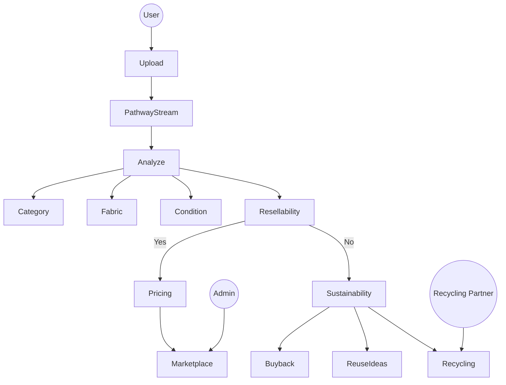

<!-- =============================================== -->
<!--                 ECOTHRIFT README               -->
<!-- =============================================== -->

<!-- Animated Header -->
<p align="center">
  
</p>

<p align="center">
  
</p>

---

# 🌱 EcoThrift 👕

> An AI-powered circular fashion marketplace that evaluates garments, predicts fair resale pricing, recommends sustainable next steps, and processes listings in real-time using Pathway streaming architecture.

---

## 💡 Idea in Brief

EcoThrift is built to reduce textile waste by transforming second-hand clothing resale into a structured, AI-driven circular economy system. Instead of allowing arbitrary pricing and unstructured resale, EcoThrift evaluates garments using AI, streams them through a real-time pricing pipeline powered by Pathway, enforces affordable resale pricing (₹50–₹900), and calculates measurable sustainability impact. The goal is to ensure every garment is intelligently evaluated and redirected toward its most sustainable next life.

---

## 🏆 Hackathon Context

EcoThrift was built for **Hack For Green Bharat**, focusing on sustainability through real-world AI applications.

**Tracks:**
- ✅ Sustainability  
- ✅ AI / Machine Learning  
- ✅ Real-Time Processing  

---

## 🌍 The Problem

Fast fashion generates enormous textile waste.

Consumers lack:
- Clear resale evaluation  
- Fair pricing guidance  
- Sustainability insights  
- Trust in second-hand marketplaces  

As a result, usable garments are discarded instead of reused.

---

## 🎯 The Solution — EcoThrift

EcoThrift intelligently evaluates garments using AI and real-time streaming to determine their **best next life**.

It can:
- 👕 Detect garment type  
- 🧵 Identify fabric  
- ⭐ Score condition  
- 📊 Predict resale probability  
- 💰 Suggest fair resale pricing (₹50–₹900 enforced)  
- ♻️ Recommend reuse or recycling  
- 🌍 Calculate sustainability metrics  

---

## 🔄 Platform Flow

Upload → Pathway Stream → AI Analyze → Value → Decide → Sustain

---

## 🧠 Use Case Diagram



---

## 🏗️ System Architecture

<p align="center">
  
</p>

---

## 🧪 AI + Real-Time Streaming Pipeline

1. **Image Upload**
2. **Pathway Streaming Ingestion**
3. **Async AI Vision Analysis**
4. **Garment Condition Scoring**
5. **Resale Probability Estimation**
6. **Dynamic Price Calculation**
7. **₹50–₹900 Affordability Enforcement**
8. **Sustainability Decision Engine**

Pathway ensures that each listing is processed asynchronously and concurrently using `AsyncTransformer`, making the system scalable and real-time.

---

## 🏗️ Tech Stack

EcoThrift is built using a modern **full-stack TypeScript architecture** integrated with real-time streaming intelligence.

---

### 1️⃣ Frontend (Client-Side)

- **Framework:** React 19  
- **Build Tool:** Vite  
- **Styling:** Tailwind CSS 4.0 (Dark Mode supported)  
- **Animations:** Motion (Framer Motion)  
- **Icons:** Lucide React  
- **Routing:** React Router 7  

---

### 2️⃣ Backend (Server-Side)

- **Runtime:** Node.js with tsx  
- **Framework:** Express  
- **Database:** SQLite (better-sqlite3)  

Stores:
- Listings  
- Users  
- Trust scores  
- Sustainability metrics  

---

### 3️⃣ Artificial Intelligence (AI)

- **Model:** Gemini 3 Flash  
- **SDK:** @google/genai  

Used for:
- Garment image analysis  
- Condition & brand understanding  
- Pricing intelligence  
- Sustainability grading (A/B)

---

### 4️⃣ Real-Time Streaming & Processing

- **Framework:** Pathway  
- **Feature Used:** AsyncTransformer  
- **Purpose:**
  - Streaming garment listing ingestion  
  - Asynchronous AI invocation  
  - Concurrent price calculation  
  - ₹50–₹900 price enforcement  
  - Real-time sustainability scoring  
  - Scalable AI pipeline architecture  

---

### 5️⃣ Core Logic Engines

- **Pricing Engine**  
  Calculates resale price (₹50–₹900) using AI + depreciation logic.

- **Trust Score Engine**  
  Ensures consistency between seller input and AI findings.

- **Sustainability Calculator**  
  Estimates:
  - 💧 Water saved  
  - 🌍 CO₂ emissions prevented  
  - ♻️ Waste diverted  

---

### 6️⃣ Languages & Tools

- **Language:** TypeScript (full stack)  
- **Environment:** Dotenv  
- **Type Safety:** TSC  
- **Package Manager:** npm  

---

## 📁 Project Structure

```
├── client/          # React frontend
├── server/          # Express backend
├── pathway/         # Real-time streaming pipeline (Pathway)
│   └── pipeline.py
├── models/          # Core business logic
├── database/        # SQLite DB
├── scripts/         # Utilities
├── screenshots/     # Demo & sponsor images
└── README.md
```

---

## 💻 Run EcoThrift Locally

### ✅ Prerequisites
- Node.js v18+
- npm
- Git

---

### 🚀 Step 1 — Clone Repository

```bash
git clone https://github.com/your-username/ecothrift.git
cd ecothrift
```

---

### 📦 Step 2 — Install Dependencies

```bash
npm install
```

If split folders:

```bash
cd client && npm install
cd ../server && npm install
```

---

### 🔐 Step 3 — Environment Setup

Create `.env` file in `server/`:

```
GEMINI_API_KEY=your_api_key_here
PORT=5000
```

---

### 🗄️ Step 4 — Start Backend

```bash
npx tsx server/index.ts
```

---

### 🌐 Step 5 — Start Frontend

```bash
npm run dev
```

---

## 🌱 Sustainability Impact

- Reduced textile landfill waste  
- Extended garment lifecycles  
- Transparent resale pricing  
- Real-time sustainability scoring  
- AI-driven circular economy model  

---

## 📈 Future Enhancements

- Carbon footprint scoring  
- Blockchain-based trust verification  
- Live demand heatmaps  
- Marketplace integrations  

---

## 🎯 Vision

To create a global AI-powered fashion ecosystem  
where every garment is intelligently evaluated  
in real time and redirected to its most sustainable next life.

EcoThrift aims to make sustainability **practical, measurable, intelligent, and scalable**.

---

<p align="center">
  
</p>
