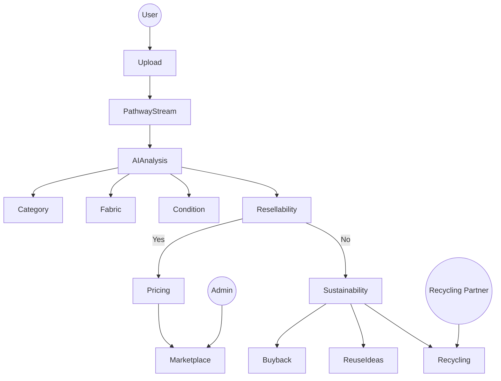

<!-- =============================================== -->
<!--                 ECOTHRIFT README               -->
<!-- =============================================== -->

<p align="center">
  
</p>

<p align="center">
  
</p>

---

# 🌱 EcoThrift 👕

> An AI-powered circular fashion intelligence platform that evaluates garments, predicts fair resale pricing, and recommends sustainable next steps using real-time streaming pipelines.

---

## 🏆 Hackathon Context

EcoThrift was built for **Hack For Green Bharat**, focusing on sustainability through real-world AI applications.

**Tracks:**
- ✅ Sustainability  
- ✅ AI / Machine Learning  
- ✅ Real-Time Data Processing  

---

## 🌍 The Problem

Fast fashion generates enormous textile waste.

Consumers lack:
- Clear resale evaluation  
- Fair pricing guidance  
- Sustainability insights  
- Trust in second-hand marketplaces  

As a result, usable garments are discarded instead of reused.

---

## 🎯 The Solution — EcoThrift

EcoThrift intelligently evaluates garments using AI and real-time streaming to determine their **best next life**.

It can:
- 👕 Detect garment type  
- 🧵 Identify fabric  
- ⭐ Score condition  
- 📊 Predict resale probability  
- 💰 Suggest fair resale pricing (₹50–₹900 enforced)  
- ♻️ Recommend reuse or recycling  
- 🌍 Calculate sustainability impact  

---

## 🔄 Platform Flow

Upload → Stream → Analyze → Value → Decide → Sustain

---

## 🧠 Use Case Diagram



---

## 🏗️ System Architecture

<p align="center">
  
</p>

---

## ⚡ Real-Time Streaming with Pathway

EcoThrift integrates **Pathway** to enable real-time asynchronous garment evaluation.

Pathway is used for:

- Streaming incoming garment listings
- Async AI invocation
- Dynamic pricing computation
- Enforcing affordability constraints (₹50–₹900)
- Sustainability metric calculation
- Scalable concurrent processing

### Why Pathway?

Instead of processing garments sequentially, EcoThrift uses a streaming architecture that:

- Handles multiple uploads concurrently  
- Processes AI results asynchronously  
- Scales pricing logic dynamically  
- Enables real-time sustainability scoring  

This transforms EcoThrift from a static resale app into a **real-time circular intelligence system**.

---

## 🧪 AI + Pathway Pipeline

1. **Image Upload**
2. **Pathway Streaming Ingestion**
3. **Async AI Vision Analysis**
4. **Garment Condition Scoring**
5. **Real-Time Price Calculation**
6. **Affordability Range Enforcement**
7. **Sustainability Impact Estimation**
8. **Marketplace Decision Routing**

---

## 🏗️ Tech Stack

EcoThrift is built using a modern **full-stack TypeScript architecture** integrated with real-time streaming intelligence.

---

### 1️⃣ Frontend (Client-Side)

- **Framework:** React 19  
- **Build Tool:** Vite  
- **Styling:** Tailwind CSS 4.0 (Dark Mode supported)  
- **Animations:** Motion (Framer Motion)  
- **Icons:** Lucide React  
- **Routing:** React Router 7  

---

### 2️⃣ Backend (Server-Side)

- **Runtime:** Node.js with `tsx`  
- **Framework:** Express  
- **Database:** SQLite (`better-sqlite3`)  

Stores:
- Listings  
- Users  
- Trust scores  
- Sustainability metrics  

---

### 3️⃣ Artificial Intelligence (AI)

- **Model:** Gemini 3 Flash  
- **SDK:** `@google/genai`  

Used for:
- Garment image analysis  
- Condition & brand understanding  
- Pricing intelligence  
- Sustainability grading  

---

### 4️⃣ Real-Time Processing Layer

- **Streaming Framework:** Pathway  

Used for:
- Async transformation of listings  
- Real-time price computation  
- Concurrency-controlled AI invocation  
- Dynamic sustainability metric updates  
- Stream-based affordability enforcement  

---

### 5️⃣ Core Logic Engines

- **Pricing Engine**  
  Calculates resale price (₹50–₹900) using AI + depreciation logic.

- **Trust Score Engine**  
  Ensures consistency between seller input and AI findings.

- **Sustainability Calculator**  
  Estimates:
  - 💧 Water saved  
  - 🌍 CO₂ emissions prevented  
  - ♻️ Waste diverted  

---

### 6️⃣ Languages & Tools

- **Language:** TypeScript (full stack)  
- **Environment:** Dotenv  
- **Type Safety:** TSC  
- **Package Manager:** npm  

---

## 📁 Project Structure

```
├── client/                # React frontend
├── server/                # Express backend
├── pathway/               # Pathway streaming pipeline
├── models/                # Core business logic
├── database/              # SQLite DB
├── scripts/               # Utilities
├── screenshots/           # Demo images
└── README.md
```

---

## 🌱 Sustainability Impact

- Reduced textile landfill waste  
- Extended garment lifecycles  
- Transparent resale pricing  
- Real-time sustainability scoring  
- Data-driven circular economy model  

---

## 🎯 Vision

To create a global AI-powered fashion ecosystem  
where every garment is intelligently evaluated  
through real-time streaming intelligence  
and redirected to its most sustainable next life.

EcoThrift aims to make sustainability **intelligent, measurable, and scalable**.

---

<p align="center">
  
</p>