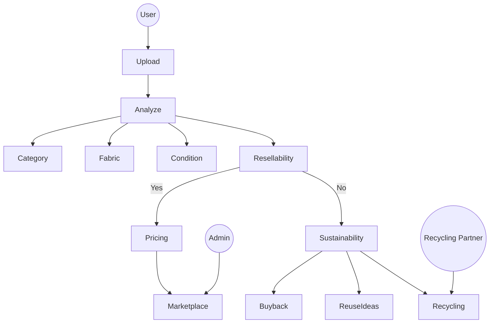

<!-- =============================================== -->
<!--                 ECOTHRIFT README               -->
<!-- =============================================== -->

<!-- Animated Header -->
<p align="center">
  
</p>

<p align="center">
  
</p>

---

# 🌱 EcoThrift 👕

> An AI-powered circular fashion marketplace that evaluates garments, predicts fair resale pricing, and recommends sustainable next steps.

---

## 🏆 Hackathon Context

EcoThrift was built for **Hack For Green Bharat**, focusing on sustainability through real-world AI applications.

**Tracks:**
- ✅ Sustainability  
- ✅ AI / Machine Learning  

---

## 🌍 The Problem

Fast fashion generates enormous textile waste.

Consumers lack:
- Clear resale evaluation  
- Fair pricing guidance  
- Sustainability insights  
- Trust in second-hand marketplaces  

As a result, usable garments are discarded instead of reused.

---

## 🎯 The Solution — EcoThrift

EcoThrift intelligently evaluates garments using AI to determine their **best next life**.

It can:
- 👕 Detect garment type  
- 🧵 Identify fabric  
- ⭐ Score condition  
- 📊 Predict resale probability  
- 💰 Suggest fair resale pricing  
- ♻️ Recommend reuse or recycling  

---

## 🔄 Platform Flow

Upload → Analyze → Value → Decide → Sustain

---

## 🧠 Use Case Diagram



---

## 🏗️ System Architecture

<p align="center">
  
</p>

---

## 🧪 AI Pipeline

1. **Image Upload**
2. **AI Vision Analysis**
3. **Garment Condition Scoring**
4. **Resale Probability Estimation**
5. **Dynamic Price Calculation**
6. **Sustainability Decision Engine**

---

## 🏗️ Tech Stack

EcoThrift is built using a modern **full-stack TypeScript architecture**.

---

### 1️⃣ Frontend (Client-Side)

- **Framework:** React 19  
- **Build Tool:** Vite  
- **Styling:** Tailwind CSS 4.0 (Dark Mode supported)  
- **Animations:** Motion (Framer Motion)  
- **Icons:** Lucide React  
- **Routing:** React Router 7  

---

### 2️⃣ Backend (Server-Side)

- **Runtime:** Node.js with `tsx`  
- **Framework:** Express  
- **Database:** SQLite (`better-sqlite3`)  

Stores:
- Listings  
- Users  
- Trust scores  
- Sustainability metrics  

---

### 3️⃣ Artificial Intelligence (AI)

- **Model:** Gemini 3 Flash  
- **Provider:** :contentReference[oaicite:0]{index=0}  
- **SDK:** `@google/genai`  

Used for:
- Garment image analysis  
- Condition & brand understanding  
- Pricing intelligence  
- Sustainability grading (A/B)

---

### 4️⃣ Core Logic Engines

- **Pricing Engine**  
  Calculates resale price (₹50–₹900) using AI + depreciation logic.

- **Trust Score Engine**  
  Ensures consistency between seller input and AI findings.

- **Sustainability Calculator**  
  Estimates:
  - 💧 Water saved  
  - 🌍 CO₂ emissions prevented  
  - ♻️ Waste diverted  

---

### 5️⃣ Languages & Tools

- **Language:** TypeScript (full stack)  
- **Environment:** Dotenv  
- **Type Safety:** TSC  
- **Package Manager:** npm  

---

## 📁 Project Structure

```
├── client/          # React frontend
├── server/          # Express backend
├── models/          # Core business logic
├── database/        # SQLite DB
├── scripts/         # Utilities
├── screenshots/     # Demo & sponsor images
└── README.md
```

---

## 💻 Run EcoThrift Locally

### ✅ Prerequisites

- Node.js v18+
- npm
- Git

Check:
```bash
node -v
npm -v
```

---

### 🚀 Step 1 — Clone Repository

```bash
git clone https://github.com/your-username/ecothrift.git
cd ecothrift
```

---

### 📦 Step 2 — Install Dependencies

```bash
npm install
```

If split folders:

```bash
cd client && npm install
cd ../server && npm install
```

---

### 🔐 Step 3 — Environment Setup

Create `.env` file in `server/`:

```
GEMINI_API_KEY=your_api_key_here
PORT=5000
```

---

### 🗄️ Step 4 — Start Backend

```bash
npx tsx server/index.ts
```

Runs at:
```
http://localhost:5000
```

---

### 🌐 Step 5 — Start Frontend

```bash
npm run dev
```

Runs at:
```
http://localhost:5173
```

---

## 🌱 Sustainability Impact

- Reduced textile landfill waste  
- Extended garment lifecycles  
- Transparent resale pricing  
- Conscious consumer behavior  

---

## 📈 Future Enhancements

- Carbon footprint scoring  
- Blockchain-based trust verification  
- Live demand heatmaps  
- Marketplace integrations  

---

## 🎯 Vision

To create a global AI-powered fashion ecosystem  
where every garment is intelligently evaluated  
and redirected to its most sustainable next life.

EcoThrift aims to make sustainability **practical, measurable, and accessible**.

---

<p align="center">
  
</p>