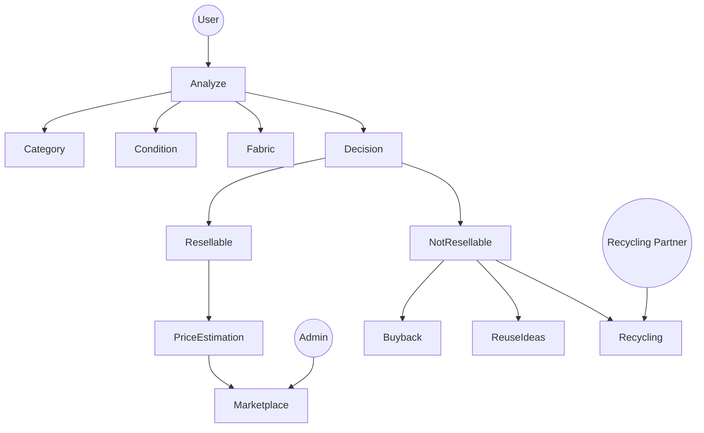

<!-- Animated Header -->
<p align="center">
  
</p>

<p align="center">
  
</p>

---

# ReWear 👕

> A circular fashion marketplace that evaluates garments for resale, predicts fair pricing, and recommends sustainable next steps.

---

## 🌍 The Problem

Fast fashion generates massive textile waste.  
Most consumers lack clarity on:

- Resellability  
- Fair pricing  
- Sustainable alternatives  

---

## 🎯 The Solution

ReWear uses computer vision + ML to:

- 👕 Detect garment category  
- 🧵 Identify fabric  
- ⭐ Score condition  
- ✅ Predict resale probability  
- 💰 Estimate price  
- ♻️ Suggest reuse or recycling  

---

## 🔄 Platform Flow (Animated)

<p align="center">
  
</p>

Upload → Analyze → Value → Decide → Sustain

---

## 🧠 Use Case Diagram



---

## 🏗️ System Architecture

<p align="center">
  
</p>

### Processing Flow

1. **Image Upload**
2. **CNN Backbone → Feature Vector**
3. **Multi-Task Prediction**
   - Category
   - Fabric
   - Condition
   - Resellability
4. **Price Regression**
5. **Lifecycle Decision Engine**

---

## 🚀 Core Features

- 📷 Image-based garment evaluation  
- 🧠 Multi-task CNN  
- 📊 Regression-driven pricing  
- ♻️ Sustainability recommendations  
- 🛍️ Marketplace integration  
- 🔍 Automated condition scoring  

---

## 🧪 Model Pipeline

### Step 1 — Image Input  
User uploads garment image.

### Step 2 — Multi-Task CNN  
Shared backbone predicts:
- Category  
- Fabric  
- Condition  
- Resellability  

### Step 3 — Price Prediction  
Regression model estimates resale value.

### Step 4 — Decision Engine  

If resellable:
→ List with suggested price  

If not:
→ Offer buyback  
→ Suggest reuse  
→ Recommend recycler  

---

## 🏗️ Tech Stack

**ML:** PyTorch / TensorFlow / Scikit-learn / OpenCV  
**Backend:** FastAPI / Flask  
**Frontend:** Streamlit (MVP) → React (Scale)  
**Data:** DeepFashion + resale datasets  

---

## 📁 Project Structure

```
├── data/
├── models/
├── notebooks/
├── app/
├── api/
└── README.md
```

---

## 🌱 Sustainability Impact

- Reduce textile landfill waste  
- Extend garment lifecycle  
- Enable circular fashion economy  
- Promote conscious consumption  

---

## 🎯 Vision

To build a fashion ecosystem where every garment is intelligently evaluated and redirected to its most sustainable next life.

---

<p align="center">
  
</p>